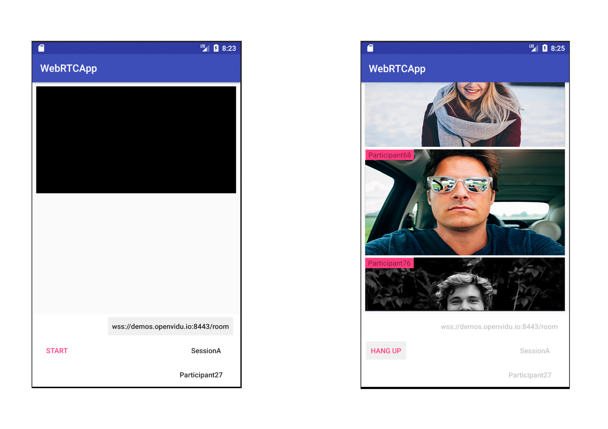

# openvidu-android-app


## What is openvidu-android-app?

openvidu-android-app is a basic generalist video conference android application that makes use of WebRTC technology and OpenVidu.
With openvidu-android-app videoconferences can be set through web socket connection to an openvidu-server using android native WebRTC libraries. It allows the user to make video-calls easily and taking full advantage of the webRTC and openvidu capabilities. 



It has been based on a previous version of an Android Application that used the WebRTC Android native libraries to connect the application to a webSocket mocked server. You can find the code [here](https://github.com/sergiopaniego/WebRTCAndroidExample) and a reference post with the "how to" [here](https://medium.com/@SergioPaniego/tutorial-on-how-to-make-the-simplest-webrtc-android-app-daacb5c8d133)
 
## OpenVidu

The app was built based on connecting to OpenVidu, an open source project that provides several libraries implementations to create video conference applications. For more info about OpenVidu:
- [OpenVidu's Docs](http://openvidu.io/docs/home/)

- [OpenVidu's Project Web](http://openvidu.io/)

- [OpenVidu's GitHub](https://github.com/OpenVidu)


## Important libraries in the project

### WebRTC Library

WebRTC is a free, open project that provides browsers and mobile applications with Real-Time Communications (RTC) capabilities via simple APIs. The WebRTC components have been optimized to best serve this purpose.
The [WebRTC Android native library] can be found on the WebRTC organisation web. Additional help on how to compile the binaries and generate the library can be found in this [WebRTC on Android Blogpost].

### ButterKnife Library

[ButterKnife] is a view binding library that uses annotation to generate boilerplate code for us. It has been developed by Jake Wharton. It makes your code less and more clear. It is time saving to write repetitive lines of code.

### WebSocket Library
The [WebSocket Library] is a WebSocket client designed for Java. It implemented the protocol definition allowing us to use a WebSocket without having to implement the whole RFC.


# Quick start guide

## How to execute the demo locally
1. Clone the project 

   ```
   git clone https://github.com/OpenVidu/openvidu-android-app
   ```

2. Open it on Android Studio (import it). 

3. Run it with the emulator that comes with the Android Studio. 

The application by default will point to the [demo OpenVidu server], it can be used to test that everything works as expected. 

## How to develop openvidu-android-app

### Tools: 
 
- **[Android Studio 3.0.1]** (Or similar).
	Is the latest version of the environment developed by Google and JetBrains to build Android apps. This IDE is built on JetBrain’s Intellij IDEA software and comes with all the tools needed to develop Android apps, from the native libraries including Kotlin to an emulator.
  
- **Android Emulator**
	integrated on the IDE. 

- **Android device**
	(highly recommended). The project has been tested on a real Samsung Galaxy S6 device no further real devices have been tested. (Please edit the list of compatible devices if you make any other tests o real devices).

- **[Sonar Qube]**
    is a tool that inspects the code to perform with a static analysis and reports back the code health. 

### Code clarification

The code is divided in some packages to make the code easier to mantain.
 - CustomWebSocketListener: This class implements WebSocketListener. As its name suggest, this class responsibility is to listen what comes to the socket we have.
 It handles the messages sent by the server
 - PeersManager: Its purpose is to manage the different peers that make a conversation
 - WebSocketTask: The negotiation with the server takes place in this class
 - RemoteParticipant: The participants info goes here
 - VideoConferenceActivity: This is the only Android Activity that the app has. It shows you the menu and the different participants camera (yours too)
 
 The WebSocket Address comes from 
 
 ```
    String sessionName = session_name.getText().toString();
    String participantName = participant_name.getText().toString();
    String socketAddress = socket_address.getText().toString();
```
            
 *socket_address* represents the editText field you can fill on the main screen.
 *participant_name* the name you give to the participant and 
 *session_name* the session name. This 3 fields are used to complete the address used to connect to the WebScoket.
 
 ```
    peersManager.setWebSocket(new WebSocketFactory().createSocket(socketAddress));
    peersManager.getWebSocket().connect();
 ```
 
In this part of the code is where the connecting happens, using the address that is built using the fields above. 

Once the connection is established, you need to join a room, what it's make as follows
```
    Map<String, String> joinRoomParams = new HashMap<>();
    joinRoomParams.put("dataChannels", "false");
    joinRoomParams.put(JSONConstants.METADATA, "{\"clientData\": \"" + participantName + "\"}");
    joinRoomParams.put("secret", MY_SECRET);
    joinRoomParams.put("session", baseAddress + sessionName);
    joinRoomParams.put("token", token);
    sendJson(websocket, "joinRoom", joinRoomParams);
```
Using a JSON using RPC 2.0 with joinRoom method and the params that are shown here you can connect to the room
Same process to leave the room, you just have to send 
```
    webSocketAdapter.sendJson(webSocket, "leaveRoom", new HashMap<String, String>());
```
a JSON RPC 2.0 with the method leaveRoom and empty params.
	
## App Permissions
The first time you open the app, it will ask you to give some permissions to the app. The permissions and the reason why we need the is the following:
-	Camera: This permission is compulsory because it wouldn’t make any sense to make a video conference app without using the camera, would it?
-	Record Audio: We need this permission to allow you to share your beautiful voice with the crowd on the other side of the conversation.

# Acknowledgments 

openvidu-android-app has been supported under project LERNIM (RTC-2016-4674-7) confunded by the Ministry of Economy, Finance and Competitiveness of Spain, as well as by the European Union FEDER, whose main goal with this funds is to promote technological development, innovation and high-quality research.

<p align="center"></p>


[WebRTC Android native library]: https://webrtc.org/native-code/android/
[WebRTC on Android Blogpost]: https://medium.com/@silvestr1994/webrtc-on-android-part-1-building-b6982aad4b49
[ButterKnife]: http://jakewharton.github.io/butterknife/
[WebSocket Library]: https://github.com/TakahikoKawasaki/nv-websocket-client
[demo OpenVidu server]: https://demos.openvidu.io/basic-videoconference/
[Android Studio 3.0.1]: https://developer.android.com/studio/index.html
[Sonar Qube]: https://www.sonarqube.org/
